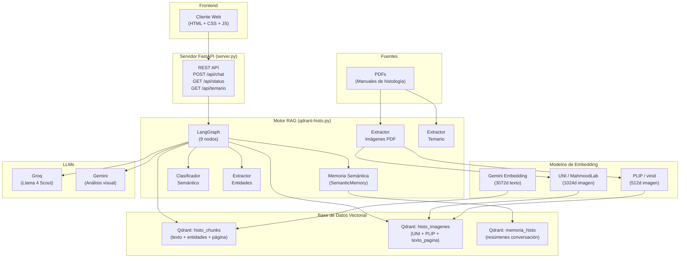
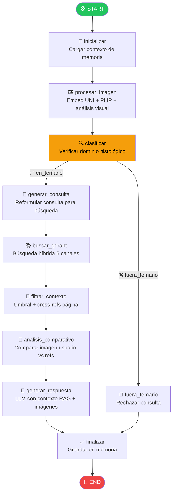
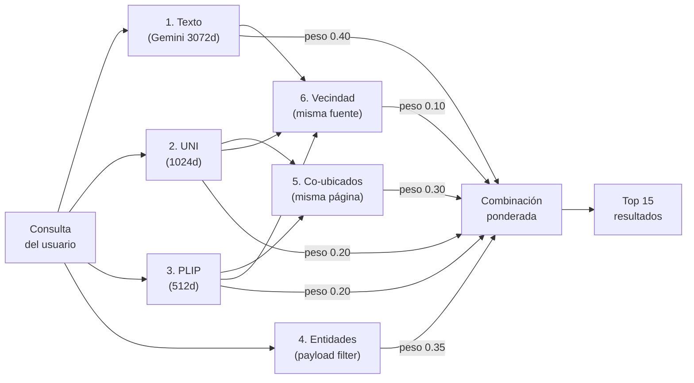
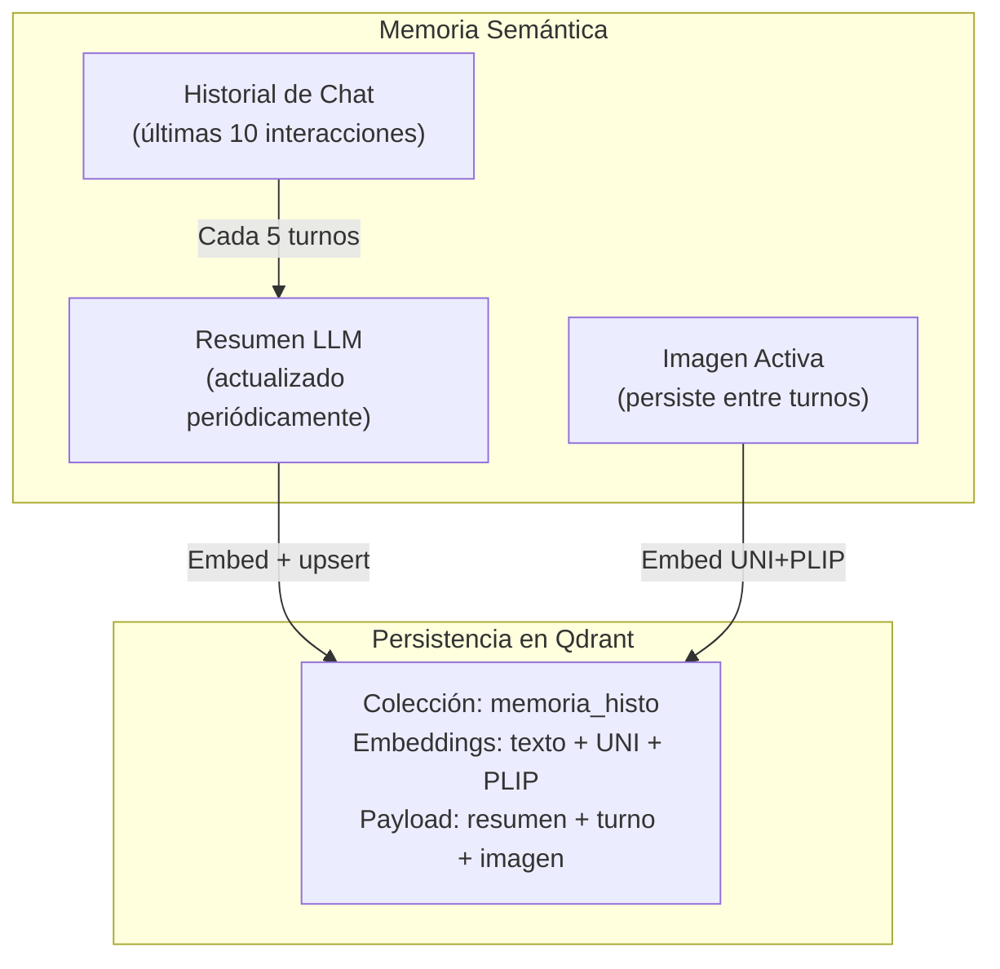

# 🔬 RAG Multimodal de Histología con Qdrant — v5.0

Sistema RAG (Retrieval-Augmented Generation) multimodal especializado en histología. Permite analizar imágenes de cortes histológicos y responder preguntas cruzando texto e imágenes de manuales en PDF, usando embeddings especializados en patología (UNI, PLIP) y búsqueda vectorial en Qdrant Cloud.

---

## 📋 Tabla de Contenidos

- [Arquitectura General](#-arquitectura-general)
- [Diagrama de Flujo LangGraph](#-diagrama-de-flujo-langgraph)
- [Pipeline de Indexación](#-pipeline-de-indexación)
- [Modelos de Embedding](#-modelos-de-embedding)
- [Chunking y Asociación Texto↔Imagen](#-chunking-y-asociación-textoimagen)
- [Colecciones Qdrant](#-colecciones-qdrant)
- [Búsqueda Híbrida](#-búsqueda-híbrida)
- [Memoria Semántica](#-memoria-semántica)
- [Clasificador Semántico de Dominio](#-clasificador-semántico-de-dominio)
- [Servidor y Frontend](#-servidor-y-frontend)
- [Instalación y Configuración](#-instalación-y-configuración)
- [Variables de Entorno](#-variables-de-entorno)
- [Uso](#-uso)
- [Estructura del Proyecto](#-estructura-del-proyecto)

---

## 🏗️ Arquitectura General



---

## 🔄 Diagrama de Flujo LangGraph

Cada consulta del usuario atraviesa un grafo de 10 nodos orquestado por LangGraph:



### Descripción de cada nodo

| Nodo | Función | Qué hace |
|------|---------|----------|
| `inicializar` | `_nodo_inicializar` | Carga contexto de memoria semántica y prepara el estado |
| `procesar_imagen` | `_nodo_procesar_imagen` | Si hay imagen nueva, genera embeddings UNI (1024d) y PLIP (512d). Genera análisis visual con Gemini. Si no hay imagen nueva, reutiliza la activa |
| `clasificar` | `_nodo_clasificar` | Extrae entidades (tejidos, estructuras, tinciones). Calcula similitud coseno con anclas semánticas del dominio. Decide si la consulta es histológica |
| `generar_consulta` | `_nodo_generar_consulta` | Reformula la consulta del usuario en términos técnicos cortos (≤8 palabras) para optimizar la búsqueda vectorial |
| `buscar_qdrant` | `_nodo_buscar_qdrant` | Ejecuta búsqueda híbrida en 6 canales (ver sección Búsqueda Híbrida) |
| `filtrar_contexto` | `_nodo_filtrar_contexto` | Filtra resultados por umbral de similitud (0.25). Recolecta imágenes de referencia (directas + cross-referenciadas desde misma página). Enriquece contexto de imagen con `texto_pagina` |
| `analisis_comparativo` | `_nodo_analisis_comparativo` | Compara la imagen del usuario contra hasta 3 imágenes de referencia del manual usando una tabla de features discriminatorias |
| `generar_respuesta` | `_nodo_generar_respuesta` | Genera la respuesta final con el LLM, usando todo el contexto RAG, imágenes, análisis comparativo y memoria |
| `finalizar` | `_nodo_finalizar` | Guarda la interacción en memoria semántica y exporta la trayectoria a JSON |
| `fuera_temario` | `_nodo_fuera_temario` | Genera una respuesta informando que la consulta está fuera del dominio histológico |

---

## 📦 Pipeline de Indexación

La indexación se ejecuta al iniciar el servidor (o con `--reindex --force`) y sigue 3 pasos:

```
PDF → Extracción de imágenes → Mapa (fuente, página) → [imagen_paths]
                                          ↓
PDF → Lectura por página → Chunking (500 chars) + refs a imágenes → Qdrant histo_chunks
                                          ↓
                                  Mapa (fuente, página) → texto_pagina
                                          ↓
Imágenes → Embed UNI + PLIP + texto_pagina ──────────────────────→ Qdrant histo_imagenes
```

### Pasos detallados

1. **Extracción de imágenes** (`ExtractorImagenesPDF`):
   - Usa PyMuPDF (fitz) para extraer imágenes individuales por xref
   - Filtra imágenes < 150px (íconos)
   - Conserva solo la imagen más grande por página
   - Fallback: renderiza la página completa con pdf2image si no hay xrefs
   - OCR con Tesseract + texto de la página como metadato

2. **Chunking por página**:
   - Lee cada página del PDF por separado
   - Divide el texto de cada página en chunks de **500 caracteres**
   - Cada chunk almacena: `pagina`, `fuente`, `imagenes_pagina` (cross-refs)

3. **Indexación de imágenes**:
   - Genera embeddings UNI (1024d) y PLIP (512d) para cada imagen
   - Almacena `texto_pagina` (texto de la misma página, hasta 2000 chars)

---

## 🧠 Modelos de Embedding

El sistema usa **3 modelos de embedding** complementarios:

| Modelo | Tipo | Dimensión | Uso | Proveedor |
|--------|------|-----------|-----|-----------|
| **Gemini Embedding** (`gemini-embedding-001`) | Texto | **3072** | Embeddings de chunks de texto para búsqueda semántica | Google (API) |
| **UNI** (`MahmoodLab/uni`) | Imagen | **1024** | Embedding visual para patología. Entrenado en histopatología | Hugging Face (local, GPU) |
| **PLIP** (`vinid/plip`) | Imagen | **512** | Embedding visual basado en CLIP, fine-tuned en patología | Hugging Face (local, GPU) |

### ¿Por qué 2 modelos de imagen?

- **UNI**: Mejor para similitud estructural (morfología del tejido, disposición celular)
- **PLIP**: Mejor para coincidencia semántica imagen-texto (descripción de lo que se ve)
- Ambos se usan en la búsqueda híbrida con pesos independientes para maximizar el recall

### Dimensiones y distancias

```python
DIM_TEXTO_GEMINI = 3072   # Embedding de texto (Gemini)
DIM_IMG_UNI      = 1024   # Embedding de imagen (UNI)
DIM_IMG_PLIP     = 512    # Embedding de imagen (PLIP)
# Todas las colecciones usan distancia COSENO
```

---

## ✂️ Chunking y Asociación Texto↔Imagen

### Estrategia de chunking

El texto se divide **por página** para mantener la localidad con las imágenes:

```
PDF Página 5 (2300 caracteres)
├── Chunk 0: chars [0-499]     → pagina=5, imagenes_pagina=["arch2_p5_img3.jpg"]
├── Chunk 1: chars [500-999]   → pagina=5, imagenes_pagina=["arch2_p5_img3.jpg"]
├── Chunk 2: chars [1000-1499] → pagina=5, imagenes_pagina=["arch2_p5_img3.jpg"]
├── Chunk 3: chars [1500-1999] → pagina=5, imagenes_pagina=["arch2_p5_img3.jpg"]
└── Chunk 4: chars [2000-2299] → pagina=5, imagenes_pagina=["arch2_p5_img3.jpg"]
```

### Parámetros

| Parámetro | Valor | Justificación |
|-----------|-------|---------------|
| **Tamaño de chunk** | 500 caracteres | Compromiso entre granularidad y contexto. Un chunk más chico permite mayor precisión de matching pero pierde contexto |
| **Overlap** | 0 (sin solapamiento) | Los chunks se cortan en posición fija. El texto de la misma página se recupera completo vía `busqueda_por_pagina()` |
| **Unidad de corte** | Caracteres (no tokens ni oraciones) | Simple y predecible. La recuperación por página compensa la falta de corte inteligente |

### Cross-referencias bidireccionales

```
                    ┌──────────────────────────────┐
                    │         CHUNK (texto)         │
                    │  pagina: 5                    │
                    │  imagenes_pagina: [img_p5.jpg]│──────┐
                    │  fuente: manual.pdf           │      │
                    └──────────────────────────────┘      │ cross-ref
                                                          │
                    ┌──────────────────────────────┐      │
                    │       IMAGEN (visual)         │      │
                    │  pagina: 5                    │◄─────┘
                    │  texto_pagina: "El tejido..." │
                    │  fuente: manual.pdf           │
                    └──────────────────────────────┘
```

- **Chunk → Imagen**: campo `imagenes_pagina` (lista de paths de imágenes en la misma página)
- **Imagen → Texto**: campo `texto_pagina` (texto completo de la página, máx 2000 chars)

---

## 🗄️ Colecciones Qdrant

### `histo_chunks` — Texto

| Campo | Tipo | Descripción |
|-------|------|-------------|
| `vector` | float[3072] | Embedding Gemini del texto |
| `chunk_id` | string | ID único: `chunk_{fuente}_{pagina}_{idx}` |
| `texto` | string | Contenido del chunk (≤500 chars) |
| `fuente` | string (indexado) | Nombre del archivo PDF |
| `pagina` | integer (indexado) | Número de página de origen |
| `chunk_idx` | integer | Índice global del chunk |
| `imagenes_pagina` | string[] | Paths de imágenes en la misma página |
| `tejidos` | string[] (indexado) | Entidades de tipo tejido extraídas |
| `estructuras` | string[] (indexado) | Entidades de tipo estructura |
| `tinciones` | string[] (indexado) | Entidades de tipo tinción |
| `tipo` | string | Siempre `"texto"` |

### `histo_imagenes` — Imágenes

| Campo | Tipo | Descripción |
|-------|------|-------------|
| `vector.uni` | float[1024] | Embedding UNI de la imagen |
| `vector.plip` | float[512] | Embedding PLIP de la imagen |
| `imagen_id` | string | ID único: `img_{fuente}_{pagina}` |
| `path` | string | Ruta local de la imagen extraída |
| `fuente` | string (indexado) | Nombre del archivo PDF |
| `pagina` | integer | Número de página de origen |
| `ocr_text` | string | OCR de la imagen + texto de la página |
| `texto_pagina` | string | Texto completo de la página (máx 2000 chars) |
| `tipo` | string | Siempre `"imagen"` |

### `memoria_histo` — Memoria de conversación

| Campo | Tipo | Descripción |
|-------|------|-------------|
| `vector.texto` | float[3072] | Embedding Gemini del resumen |
| `vector.uni` | float[1024] | Embedding UNI de la imagen activa |
| `vector.plip` | float[512] | Embedding PLIP de la imagen activa |
| `resumen` | string | Resumen técnico generado por el LLM |
| `turno_fin` | integer | Turno de la conversación |
| `tiene_imagen` | boolean | Si había imagen activa |
| `imagen_path` | string | Path de la imagen activa |

---

## 🔍 Búsqueda Híbrida

La búsqueda combina **6 canales** con pesos ponderados:



| Canal | Peso | Colección | Descripción |
|-------|------|-----------|-------------|
| **Texto** | 0.40 | `histo_chunks` | Similitud coseno del embedding Gemini de la consulta vs chunks |
| **UNI** | 0.20 | `histo_imagenes` | Similitud visual UNI de la imagen del usuario vs imágenes del manual |
| **PLIP** | 0.20 | `histo_imagenes` | Similitud visual PLIP |
| **Entidades** | 0.35 | `histo_chunks` | Filtro por payload (tejidos, estructuras, tinciones) con MatchAny |
| **Co-ubicados** | 0.30 | `histo_chunks` | Chunks de la misma página que las imágenes encontradas (filtro `fuente` + `pagina`) |
| **Vecindad** | 0.10 | ambas | Chunks e imágenes adicionales de las mismas fuentes que los mejores resultados |

### Umbral de similitud

```python
SIMILARITY_THRESHOLD = 0.25  # Resultados por debajo de esto se descartan
```

---

## 🧠 Memoria Semántica

La clase `SemanticMemory` mantiene contexto entre turnos de conversación:



### Funcionamiento

1. **Historia directa**: Las últimas 3 interacciones se mantienen en texto plano como `direct_history`
2. **Resumen periódico**: Cada 5 turnos, el LLM genera un resumen técnico del historial
3. **Persistencia**: El resumen se almacena en Qdrant con 3 embeddings (texto + UNI + PLIP) para recuperación futura
4. **Imagen activa**: La última imagen subida persiste entre turnos. Se reutiliza automáticamente si el usuario no sube una nueva. Comando `"nueva imagen"` la limpia
5. **Contexto para consulta**: Antes de cada búsqueda, el sistema recupera resúmenes relevantes de Qdrant por similitud con la consulta actual

### Parámetros de memoria

| Parámetro | Valor | Descripción |
|-----------|-------|-------------|
| `max_entries` | 10 | Máximo de interacciones en memoria local |
| Historial directo | 3 últimas | Interacciones en texto plano para el LLM |
| Guardado en Qdrant | cada 5 turnos | Frecuencia de persistencia |
| Resumen máximo | sin límite | Generado por el LLM |

---

## 🏷️ Clasificador Semántico de Dominio

La clase `ClasificadorSemantico` determina si una consulta pertenece al dominio histológico:

1. **Embedding de la consulta** con Gemini
2. **Similitud coseno** contra 12 anclas semánticas predefinidas (frases clave de histología)
3. **Umbral**: similitud ≥ 0.70 → dominio histológico validado
4. **Fallback LLM**: si hay imagen activa, el LLM razona sobre el análisis visual para validar

### Anclas semánticas

```python
ANCLAS_SEMANTICAS_HISTOLOGIA = [
    "histología tejido celular microscopía",
    "tipos de tejido epitelial conectivo muscular nervioso",
    "coloración hematoxilina eosina H&E tinción histológica",
    "estructuras celulares núcleo citoplasma membrana",
    "diagnóstico diferencial patología biopsia",
    # ... 7 más
]
```

---

## 🌐 Servidor y Frontend

### Backend (`server.py`)

FastAPI wrappea `AsistenteHistologiaQdrant` y expone:

| Endpoint | Método | Descripción |
|----------|--------|-------------|
| `/` | GET | Sirve el frontend (index.html) |
| `/api/status` | GET | Estado del sistema (ready, n_temas, imagen_activa, device) |
| `/api/temario` | GET | Lista de temas extraídos del PDF |
| `/api/chat` | POST | Envía consulta (texto + imagen base64) → respuesta RAG |
| `/api/imagen/limpiar` | POST | Limpia la imagen activa de la sesión |

### Frontend (`client/`)

Interfaz web con 3 archivos:
- `index.html`: Estructura HTML del chat
- `style.css`: Estilos (17KB, dark theme con glassmorphism)
- `app.js`: Lógica del chat, upload de imágenes, renderizado de respuestas

---

## ⚙️ Instalación y Configuración

### Requisitos previos

- Python ≥ 3.10
- GPU NVIDIA con CUDA (recomendado, funciona en CPU pero más lento)
- Tesseract OCR: `sudo apt install tesseract-ocr`
- Poppler (para pdf2image): `sudo apt install poppler-utils`
- [uv](https://docs.astral.sh/uv/) (gestor de paquetes Python)

### Instalación

```bash
# 1. Clonar el repositorio
git clone https://github.com/dracero/histo-test-qdrant.git
cd histo-test-qdrant

# 2. Instalar dependencias con uv
uv sync

# 3. Copiar y completar las variables de entorno
cp .env.example .env
# Editar .env con tus claves (ver sección Variables de Entorno)

# 4. Colocar PDFs de histología en la carpeta pdf/
mkdir -p pdf
# Copiar tus PDFs ahí

# 5. Iniciar el servidor (primera vez = indexa automáticamente)
npm run dev
```

### Re-indexación

Si cambiás los PDFs o querés forzar re-indexación:

```bash
# Desde la interfaz npm
npm run dev -- --reindex --force

# O directamente con Python
uv run python qdrant-histo.py --reindex --force
```

---

## 🔑 Variables de Entorno

Copiar `.env.example` a `.env` y completar:

| Variable | Requerida | Descripción |
|----------|-----------|-------------|
| `GOOGLE_API_KEY` | ✅ | API Key de Google Gemini (embeddings + análisis visual) |
| `GROQ_API_KEY` | ✅ | API Key de Groq (LLM para chat y razonamiento) |
| `QDRANT_URL` | ✅ | URL de tu instancia Qdrant Cloud |
| `QDRANT_KEY` | ✅ | API Key de Qdrant Cloud |
| `HF_TOKEN` | ✅ | Token de Hugging Face (acceso a modelos UNI) |
| `LANGSMITH_API_KEY` | ❌ | API Key de LangSmith (observabilidad, opcional) |

### Obtener las claves

1. **GOOGLE_API_KEY**: [Google AI Studio](https://aistudio.google.com/apikey)
2. **GROQ_API_KEY**: [Groq Console](https://console.groq.com/keys)
3. **QDRANT_URL + QDRANT_KEY**: [Qdrant Cloud](https://cloud.qdrant.io/) → crear cluster gratuito
4. **HF_TOKEN**: [Hugging Face Settings](https://huggingface.co/settings/tokens) → con acceso a `MahmoodLab/uni`
5. **LANGSMITH_API_KEY**: [LangSmith](https://smith.langchain.com/) (opcional)

---

## 🚀 Uso

### Modo servidor (recomendado)

```bash
npm run dev
# Abrir http://localhost:10005
```

### Modo interactivo (terminal)

```bash
uv run python qdrant-histo.py
```

Comandos especiales en modo interactivo:
- `temario` → ver temas disponibles
- `imagen actual` → ver la imagen activa
- `nueva imagen` → limpiar imagen activa
- `salir` → terminar

---

## 📁 Estructura del Proyecto

```
histo-test-qdrant/
├── qdrant-histo.py          # Motor RAG principal (2400+ líneas)
│   ├── QdrantVectorStore    # Wrapper Qdrant Cloud (2 colecciones)
│   ├── SemanticMemory       # Memoria con persistencia Qdrant
│   ├── ClasificadorSemantico# Verificación de dominio
│   ├── ExtractorImagenesPDF # Extracción de figuras con PyMuPDF
│   ├── ExtractorTemario     # Extracción de temas con LLM
│   ├── ExtractorEntidades   # Extracción de tejidos/estructuras/tinciones
│   ├── PlipWrapper          # Wrapper PLIP (512d)
│   ├── UniWrapper           # Wrapper UNI (1024d)
│   └── AsistenteHistologiaQdrant  # Orquestador principal (LangGraph)
│
├── server.py                # Servidor FastAPI (fullstack)
├── client/                  # Frontend web
│   ├── index.html
│   ├── style.css
│   └── app.js
│
├── pdf/                     # 📚 Manuales de histología (PDFs)
├── imagenes_extraidas/      # 🖼️ Imágenes extraídas de los PDFs
├── imagenes_chat/           # 📷 Imágenes subidas por el usuario
│
├── pyproject.toml           # Dependencias Python (uv)
├── package.json             # Scripts npm (dev, start)
├── .env                     # Variables de entorno (no committear)
├── .env.example             # Template de variables de entorno
└── README.md                # Este archivo
```

---

## 📄 Licencia

ISC
