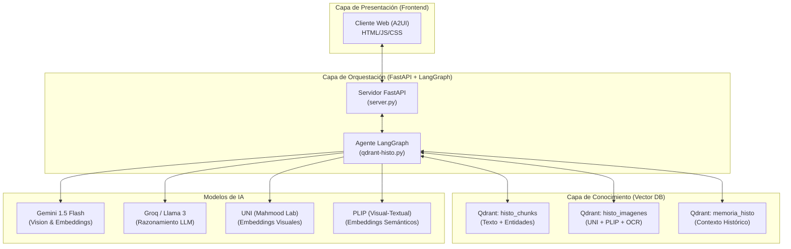

# 🔬 MUVERA: RAG Multimodal de Histología con Qdrant y LangGraph

**MUVERA** (Multimodal Visual Entity Retrieval Assistant) es un sistema avanzado de **RAG (Retrieval-Augmented Generation)** especializado en el dominio de la **histología**. Utiliza una arquitectura agéntica basada en **LangGraph** para orquestar la recuperación de conocimiento técnico desde manuales en PDF, integrando análisis visual profundo mediante modelos especializados en patología.

---

## 🚀 Visión General

El sistema permite a estudiantes y profesionales realizar consultas complejas sobre cortes histológicos, ya sea mediante texto puro o combinando texto con imágenes. MUVERA no solo "busca" información; razona sobre el contenido visual y textual para proporcionar respuestas precisas, comparativas y contextualizadas.

### Capacidades Principales:
- **Análisis Multimodal**: Procesa imágenes de microscopía y texto técnico en un mismo flujo.
- **Recuperación Híbrida de 6 Canales**: Combina embeddings visuales (UNI, PLIP) y textuales (Gemini) con filtros de entidades.
- **Memoria Semántica Persistente**: Mantiene el contexto de la conversación y las imágenes activas entre turnos.
- **Clasificación de Dominio**: Valida que las consultas pertenezcan al ámbito histológico antes de procesarlas.
- **Análisis Comparativo**: Capacidad de contrastar la imagen del usuario con referencias directas de los manuales.

---

## 🏗️ Arquitectura del Sistema

El sistema se divide en tres capas principales que interactúan de forma asíncrona:



---

## 🔄 Pipeline Agéntico (LangGraph)

Cada consulta atraviesa un grafo de estados que decide dinámicamente el camino a seguir:

1.  **Inicializar**: Recupera el estado anterior y la memoria semántica desde Qdrant.
2.  **Router de Modo**: Detecta si la consulta es "Solo Texto" o "Multimodal".
3.  **Procesar Imagen**: Si hay una imagen, genera embeddings UNI (morfológicos) y PLIP (semánticos), además de un análisis visual descriptivo con Gemini.
4.  **Clasificar**: Verifica si la consulta es de histología comparando embeddings con "anclas semánticas".
5.  **Generar Consulta**: El LLM reformula la pregunta original en términos técnicos optimizados para búsqueda vectorial.
6.  **Buscar (Hybrid Search)**: Ejecuta la búsqueda en los 6 canales (ver abajo).
7.  **Filtrar Contexto**: Aplica umbrales de similitud (0.30 para texto, 0.70 para imágenes) y recolecta referencias cruzadas.
8.  **Análisis Comparativo**: Crea una tabla de características discriminatorias entre la imagen del usuario y las referencias del manual.
9.  **Generar Respuesta**: El LLM sintetiza la respuesta final integrando todo el contexto recuperado.
10. **Finalizar**: Persiste la interacción en la memoria semántica.

---

## 🔍 Motor de Búsqueda Híbrido (6 Canales)

La potencia de MUVERA reside en su capacidad de mirar los datos desde múltiples ángulos simultáneamente:

| Canal | Peso | Descripción |
| :--- | :--- | :--- |
| **Texto Semántico** | 0.40 | Similitud de coseno entre el embedding Gemini de la consulta y los chunks de texto. |
| **Embedding UNI** | 0.20 | Similitud morfológica pura (estructuras, patrones celulares) usando el modelo UNI. |
| **Embedding PLIP** | 0.20 | Similitud semántica imagen-texto (conceptos) usando el modelo PLIP. |
| **Filtro de Entidades**| 0.35 | Coincidencia exacta de tejidos, estructuras y tinciones extraídas por el agente. |
| **Co-ubicación** | 0.30 | Prioriza chunks que están en la misma página que las imágenes visualmente similares. |
| **Vecindad** | 0.10 | Explora chunks y fotos cercanas (mismo manual/capítulo) para ampliar el contexto. |

---

## 🧠 Modelos de Embedding Especializados

| Modelo | Dimensión | Especialidad |
| :--- | :--- | :--- |
| **Gemini-001** | 3072 | Representación de conceptos médicos y texto técnico de alta dimensionalidad. |
| **UNI (MahmoodLab)** | 1024 | Pre-entrenado en millones de parches histológicos. Captura la arquitectura del tejido. |
| **PLIP (vinid)** | 512 | Alineación visual-textual para patología. Ideal para buscar imágenes mediante descripciones. |

---

## 📦 Estructura del Proyecto

- `server.py`: Punto de entrada FastAPI. Gestiona el ciclo de vida de la aplicación y el frontend.
- `qdrant-histo.py`: Núcleo del sistema. Contiene la lógica de LangGraph, clases de búsqueda y procesamiento de PDF.
- `client/`: Interfaz web moderna (glassmorphism dark theme) con visor de imágenes y trayectoria del agente.
- `pdf/`: Directorio donde se deben colocar los manuales de histología en formato PDF.
- `imagenes_extraidas/`: Almacén de figuras extraídas automáticamente durante la indexación.
- `pyproject.toml`: Gestión de dependencias ultra-rápida mediante `uv`.

---

## ⚙️ Instalación y Uso

### Requisitos
- **Python 3.10+**
- **GPU NVIDIA** (Recomendado para UNI/PLIP)
- **Tesseract OCR** & **Poppler Utils** instalados en el sistema.

### Configuración
1.  Clonar el repositorio.
2.  Instalar dependencias: `uv sync`.
3.  Configurar `.env` con las siguientes claves:
    - `GOOGLE_API_KEY`: Para Gemini Vision y Embeddings.
    - `GROQ_API_KEY`: Para el razonamiento Llama 3.
    - `QDRANT_URL` & `QDRANT_KEY`: Para la base de datos vectorial.
    - `HF_TOKEN`: Para descargar los modelos UNI/PLIP desde Hugging Face.

### Ejecución
Para iniciar en modo desarrollo con recarga automática:
```bash
npm run dev
```

Para forzar una re-indexación de los PDFs:
```bash
uv run python qdrant-histo.py --reindex --force
```

---

## 📄 Licencia

Este proyecto está bajo la licencia **ISC**. Desarrollado para el análisis avanzado de histología mediante IA.
